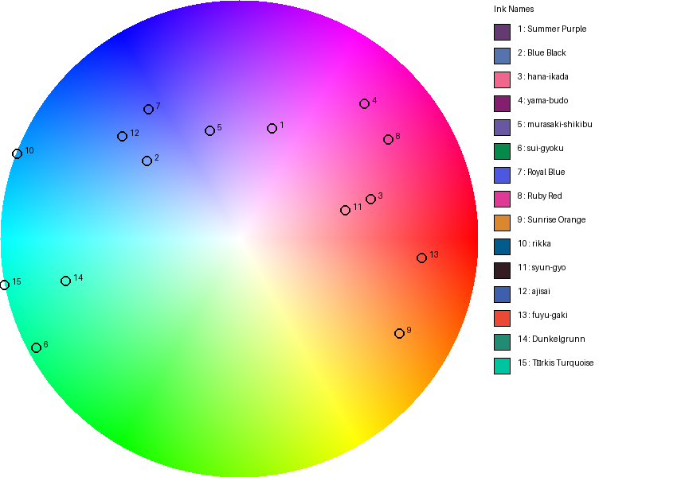
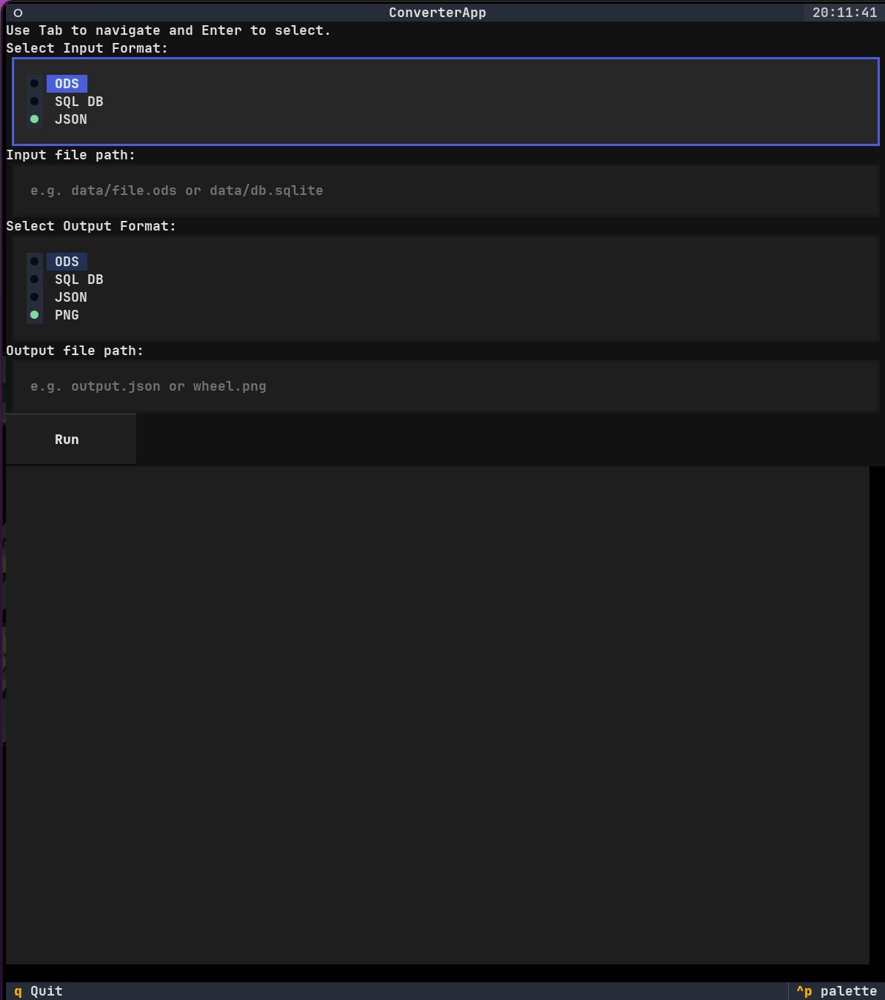
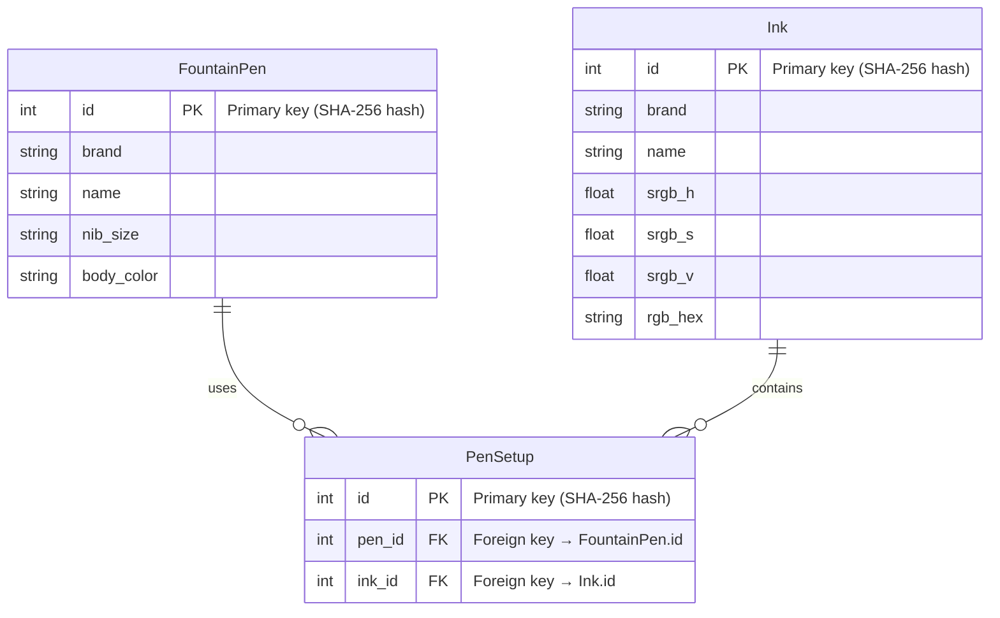

# Color Wheel Generator

Generates a high-quality RGB color wheel image with customizable markers
and a side legend detailing each color.

## Features

- Smooth HSV-based color wheel rendering
- Numbered markers for specified hex colors
- Legend with color swatches, name of the ink
- Configurable canvas dimensions, marker size, and output filename

## Table of Contents

1. [Demo](#demo)
2. [Installation](#installation)
3. [Usage](#usage)
4. [Configuration](#configuration)
5. [Data Integration](#data-integration)
6. [Development](#development)
7. [License](#license)

## Demo



## Installation

Ensure you have Python 3.14+ installed.

### Installing without uv

If uv is not available, a virtual environment can be created, activated and dependencies can be installed with pip:

```bash
python3 -m venv .venv
source .venv/bin/activate
python -m pip install -U pip
python -m pip install -e .
```

After this the gui can be started like:

```bash
python3 ui.py
```

### Installing with uv

Install all dependencies via `uv`:

```bash
uv sync
```

This will install runtime dependencies including `pillow` and `sqlalchemy`.

## Usage

Run the generator script, export to JSON, or load data into a SQL database:

```bash
# Generate color wheel image
uv run main.py [-o OUTPUT_FILE] [-v] [--use-data] [--data-file PATH]

# Export existing database records to JSON
uv run main.py --db-url sqlite:///pens.db --export-json data/export.json

# Load pens, inks, and setups into a SQL database
uv run main.py --db-url sqlite:///pens.db [--data-file PATH]

# Launch the interactive converter UI
uv run ui.py
```

### Options for Main

```bash
- `-o, --output` : output filename (default: `color_wheel_with_legend.png`)
- `-v, --verbose`: enable verbose logging to console and file (`colorwheel.log`)
- `--use-data` : use colors from the ODS data file instead of defaults
- `--data-file` : path to the ODS data file (default: `data/golden.ods`)
```

### Options for UI

- `-v, --verbose`: increase verbosity level (use `-v` for WARNING, `-vv` for INFO, `-vvv` for DEBUG).

## Interactive Converter UI

The project includes a Textual-based interactive converter interface implemented in `ui.py`. You can:

- Select input format (ODS, SQL DB, JSON)
- Specify input and output file paths
- Choose output format (ODS, SQL DB, JSON, PNG)
- View live conversion logs in the embedded console
- Navigate with Tab, select options with Enter, and press Run to execute

Example screenshot:


### UI CLI & Logging

- **Usage**: launch with `python ui.py [options]` or `uv run ui.py [options]`.
- **Logging** is set up via `setup_logging()` in `ui.py`:
  - Logs at INFO level to stderr by default (e.g. conversion start/errors).
  - If verbosity ≥2, DEBUG-level messages are also written to `colorwheel_ui.log`.
  - The logger name is `colorwheel_ui` and uses separate handlers for console and file.

## Configuration

At the top of `main.py`, adjust constants to modify the output:

- `WHEEL_SIZE` (int): diameter of the wheel in pixels
- `LEGEND_WIDTH` (int): width of the legend panel
- `HEX_COLORS` (list of tuples): pairs of color name and hex code to mark on the wheel (e.g., `("Red", "#FF0000")`)
- `MARKER_RADIUS` (int): radius of each marker dot
- `OUTPUT_FILE` (str): name of the saved image

## Data Integration

Below is the Entity-Relationship diagram for Pens, Inks, and Setups:



The `data/golden.ods` file contains pen and ink definitions.
Use the `data_reader.py` module to load detailed setups. It now returns dictionaries keyed by each item's SHA-256-based `id`:

Note that each `FountainPen`, `Ink`, and `PenSetup` now includes an `id` attribute
generated as a SHA-256 hash of its key fields.

```python
from data_reader import DataReader

# initialize reader (parses and builds objects)
reader = DataReader('data/golden.ods')
# raw rows, pens, inks, and setups are available as attributes
print(reader.raw_rows)        # List[Dict[str,str]]
# pens: Dict[id, FountainPen]
print(reader.pens)            # Dict of pen_id → FountainPen
# inks: Dict[id, Ink]
print(reader.inks)            # Dict of ink_id → Ink
# setups: Dict[id, PenSetup]
print(reader.setups)          # Dict of setup_id → PenSetup

# or directly iterate pen setups:
for setup in reader.setups:
    pen = setup.pen
    ink = setup.ink
    print(f"{pen.brand} {pen.name} ({pen.nib_size}) → {ink.name} [{ink.color_rgb_hex}]")
```

### Database ORM

Persist pens, inks, and setups to a SQL database using the SQLAlchemy ORM in `orm.py`:

```python
from sqlalchemy.orm import sessionmaker
from orm import load_data_from_ods, FountainPen, Ink, PenSetup

# Load data into SQLite database
    'data/golden.ods',
    'sqlite:///pens.db'
)
# Querying
Session = sessionmaker(bind=engine)
session = Session()
pens = session.query(FountainPen).all()
inks = session.query(Ink).all()
setups = session.query(PenSetup).all()
for pen in pens:
    print(pen.brand, pen.name)
```

## Development

1. Install development dependencies (including dev extras):
   ```bash
   uv sync
   ```
2. Run tests:
   ```bash
   make all
   ```
3. Lint code:
   ```bash
   uv run flake8
   ```
4. Run tests with coverage:
   ```bash
   make coverage
   ```

## Testing

- The test suite uses `pytest` under `tests/`.
- **UI tests** (`tests/test_ui_app.py`) launch ConverterApp in headless mode and verify:
  - Smoke test clicks Run without errors
  - End-to-end conversion flows for supported format combinations
- **Converter function tests** (`tests/test_ui_conversion.py`) exercise each handler in `ui_converters.py`:
  - Database-to-PNG and ODS-to-PNG image comparisons
  - ODS/DB ↔ JSON round-trip consistency
  - File existence and schema validations
- Run all tests with coverage:
  ```bash
  pytest --cov=. --cov-report=term-missing tests
  ```

4. Set up Git pre-commit hooks:
   ```bash
   # Install the git hook scripts
   uv run pre-commit install
   ```

## License

This project is released under the MIT License.
