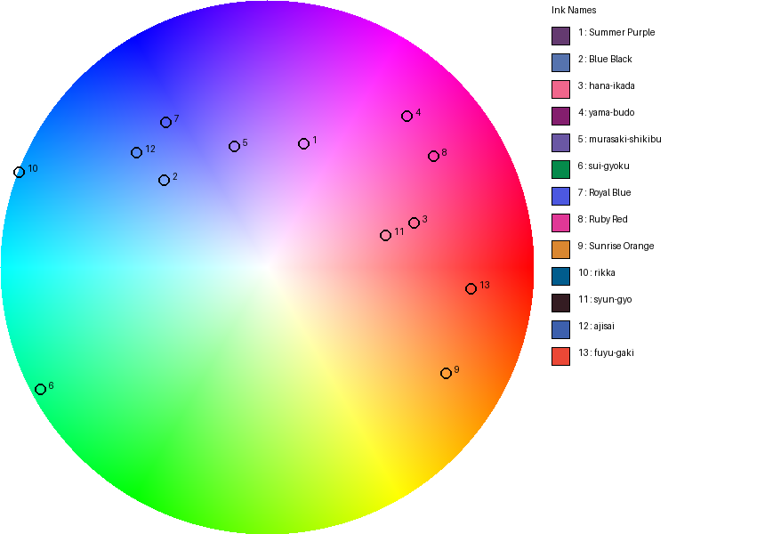

# Color Wheel Generator

#

Generates a high-quality RGB color wheel image with customizable markers
and a side legend detailing each color.

## Features

- Smooth HSV-based color wheel rendering
- Numbered markers for specified hex colors
- Legend with color swatches, hex codes, and RGB values
- Configurable canvas dimensions, marker size, and output filename

## Table of Contents

1. [Demo](#demo)
2. [Installation](#installation)
3. [Usage](#usage)
4. [Configuration](#configuration)
5. [Data Integration](#data-integration)
6. [Development](#development)
7. [License](#license)

## Demo



## Installation
Ensure you have Python 3.14+ installed. Then install the Pillow dependency:
```bash
pip install pillow
```
Optionally, install this package locally:
```bash
pip install .
```

## Usage
Run the generator script:
```bash
python main.py [-o OUTPUT_FILE] [-v] [--use-data] [--data-file PATH]
```
Options:
- `-o, --output` : output filename (default: `color_wheel_with_legend.png`)
- `-v, --verbose`: enable verbose logging to console and file (`colorwheel.log`)
- `--use-data`   : use colors from the ODS data file instead of defaults
- `--data-file` : path to the ODS data file (default: `data/tinta_szinek.ods`)
Options:
- `-o, --output` : set the output filename (default: `color_wheel_with_legend.png`)
- `-v, --verbose`: enable verbose logging to console and `colorwheel.log`

## Configuration
At the top of `main.py`, adjust constants to modify the output:
- `WHEEL_SIZE` (int): diameter of the wheel in pixels
- `LEGEND_WIDTH` (int): width of the legend panel
- `HEX_COLORS` (list of str): hex codes to mark on the wheel
- `MARKER_RADIUS` (int): radius of each marker dot
- `OUTPUT_FILE` (str): name of the saved image

## Data Integration
The `data/tinta_szinek.ods` file contains pen and ink definitions.
Use the `data_reader.py` module to load detailed setups:

```python
from data_reader import DataReader

# initialize reader (parses and builds objects)
reader = DataReader('data/tinta_szinek.ods')
# raw rows, pens, inks, and setups are available as attributes
print(reader.raw_rows)        # List[Dict[str,str]]
print(reader.pens)            # List[FountainPen]
print(reader.inks)            # List[Ink]
print(reader.setups)          # List[PenSetup]

# or directly iterate pen setups:
for setup in reader.setups:
    pen = setup.pen
    ink = setup.ink
    print(f"{pen.brand} {pen.name} ({pen.nib_size}) → {ink.name} [{ink.color_rgb_hex}]")
```

## Development
1. Create and activate a virtual environment:
   ```bash
   python -m venv .venv
   source .venv/bin/activate
   ```
2. Install dev dependencies:
   ```bash
   pip install -e .[dev]
   ```
3. Run tests with pytest:
   ```bash
   pytest
   ```
4. Lint with [flake8]:
   ```bash
   flake8
   ```

## License
This project is released under the MIT License.
